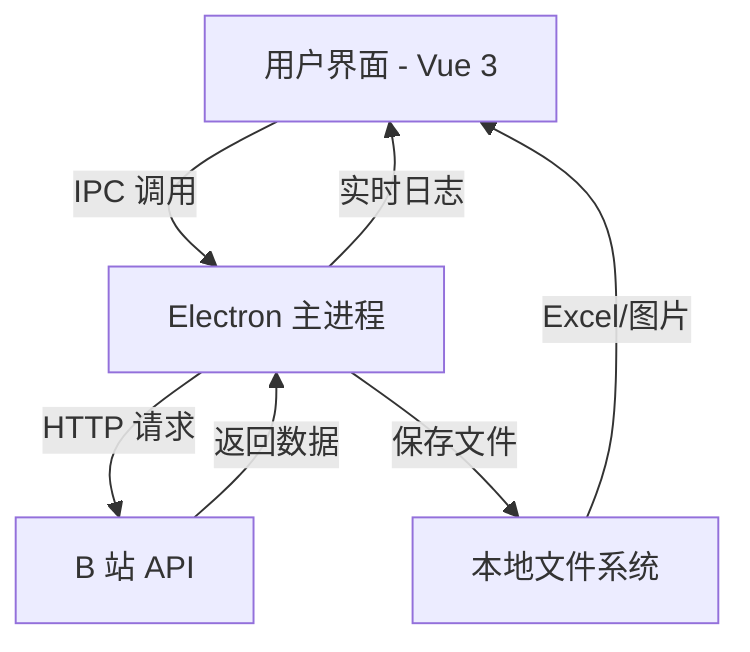

## 产品概述

将现有的 B 站鸣潮热门视频采集 Python 脚本（bilibili_mingchao_scraper.py）转换为 Windows 桌面端软件，使用 Electron + Vue 技术栈实现，保持原有功能不变，提供友好的图形用户界面。

## 核心功能

- **功能1：搜索热门视频** - 搜索"鸣潮"关键词相关视频，获取播放量 TOP 10 视频，自动下载封面图片，生成 Excel 表格和文本报告
- **功能2：获取封面** - 用户输入 BV 号，获取该视频的详细信息（标题、作者等），下载视频封面图片
- **界面布局**：
- 左侧：功能列表导航（搜索热门视频、获取封面）
- 中间：交互区域（输入框 + 开始按钮）
- 底部：运行信息显示框（显示实时运行日志和最终结果）

## 技术栈选择

- **前端框架**：Vue 3 (Composition API) + TypeScript
- **UI 组件库**：Element Plus（适合桌面端应用，组件丰富）
- **桌面端框架**：Electron 28+
- **HTTP 请求**：Axios（替代 Python 的 requests 库）
- **Excel 生成**：ExcelJS（替代 Python 的 openpyxl 库）
- **构建工具**：Vite（快速开发和构建）
- **打包工具**：electron-builder（生成 Windows 可执行文件）

## 实现方案

### 整体架构

采用 Electron 经典架构：

- **主进程（Main Process）**：负责管理应用生命周期、创建浏览器窗口、处理 IPC 通信
- **渲染进程（Renderer Process）**：Vue 应用，负责 UI 展示和用户交互
- **预加载脚本（Preload Script）**：安全地暴露主进程 API 给渲染进程

### 核心技术方案

1. **Python 逻辑迁移**：将 Python 爬虫逻辑用 Node.js 重写

- HTTP 请求：使用 Axios 库，保持与原程序相同的请求头和参数
- Excel 生成：使用 ExcelJS 库，复刻原程序的表格样式（表头样式、列宽、超链接等）
- 文件下载：使用 Node.js 原生 fs 和 https/http 模块
- 数据解析：保持与原程序相同的数据处理逻辑和排序规则

2. **IPC 通信设计**：

- 渲染进程通过 `ipcRenderer.invoke` 调用主进程方法
- 主进程通过 `ipcMain.handle` 处理渲染进程请求
- 使用 `webContents.send` 实现主进程向渲染进程推送实时日志

3. **实时日志显示**：

- 主进程执行爬虫任务时，通过 IPC 实时发送日志信息
- 渲染进程接收日志并动态更新显示框内容
- 使用流式输出，模拟终端输出效果

### 性能与可靠性考虑

- **请求重试机制**：保留原程序的重试逻辑（最多 3 次），使用 async/await 实现
- **请求间隔控制**：使用 setTimeout 实现请求间隔（0.5秒），避免被 B 站 API 限制
- **错误处理**：完善的 try-catch 和错误提示机制，友好展示给用户
- **文件路径管理**：使用 Electron 的 app.getPath('userData') 获取正确的用户数据目录

## 架构设计

### 系统架构图



### 模块划分

1. **渲染进程模块（Vue 应用）**：

- `App.vue`：主应用组件，包含左侧导航和中间内容区
- `components/FunctionList.vue`：左侧功能列表组件
- `components/SearchVideo.vue`：搜索热门视频功能组件
- `components/DownloadCover.vue`：获取封面功能组件
- `components/LogViewer.vue`：运行日志显示组件

2. **主进程模块**：

- `main.js`：Electron 主进程入口，创建窗口和应用生命周期管理
- `ipc-handlers.js`：IPC 通信处理器，处理渲染进程请求
- `services/bilibili-service.js`：B 站 API 调用服务（核心业务逻辑）
- `services/excel-service.js`：Excel 生成服务
- `services/file-service.js`：文件下载和保存服务

## 目录结构

新项目将创建在 `d:\C\Bclaw-Mixed\bilibili-desktop-app\` 目录下，与原有 Python 程序完全分离。

```
bilibili-desktop-app/
├── src/
│   ├── main/
│   │   ├── main.js              # [NEW] Electron 主进程入口
│   │   ├── ipc-handlers.js      # [NEW] IPC 通信处理器
│   │   └── services/
│   │       ├── bilibili-service.js  # [NEW] B站API调用服务
│   │       ├── excel-service.js     # [NEW] Excel生成服务
│   │       └── file-service.js      # [NEW] 文件下载服务
│   ├── renderer/
│   │   ├── src/
│   │   │   ├── App.vue          # [NEW] Vue根组件
│   │   │   ├── main.ts          # [NEW] Vue应用入口
│   │   │   ├── components/
│   │   │   │   ├── FunctionList.vue   # [NEW] 功能列表组件
│   │   │   │   ├── SearchVideo.vue    # [NEW] 搜索视频组件
│   │   │   │   ├── DownloadCover.vue  # [NEW] 下载封面组件
│   │   │   │   └── LogViewer.vue      # [NEW] 日志显示组件
│   │   │   ├── styles/
│   │   │   │   └── global.css   # [NEW] 全局样式
│   │   │   └── types/
│   │   │       └── index.ts     # [NEW] TypeScript类型定义
│   │   └── index.html           # [NEW] HTML入口文件
│   └── preload/
│       └── preload.js           # [NEW] 预加载脚本
├── electron-builder.yml         # [NEW] Electron打包配置
├── package.json                 # [NEW] 项目依赖配置
├── vite.config.js               # [NEW] Vite构建配置
└── README.md                    # [NEW] 项目说明文档
```

## 关键代码结构

### TypeScript 类型定义

```typescript
// src/renderer/src/types/index.ts
export interface VideoInfo {
  title: string;
  author: string;
  bvid: string;
  play_count: number;
  play_str: string;
  duration: string;
  pubdate: number;
  video_review: number;
  likes: number;
  pic: string;
  url: string;
}

export interface LogMessage {
  type: 'info' | 'success' | 'error' | 'warning';
  content: string;
  timestamp: string;
}
```

## 设计风格

采用现代桌面应用设计风格，简洁专业，注重用户体验和功能性。整体色调以蓝色为主，搭配浅灰色背景，营造清晰的视觉层次。

### 整体布局

- **左侧导航栏**：宽度 200px，固定位置，包含功能列表
- 功能1：搜索热门视频（图标 + 文字）
- 功能2：获取封面（图标 + 文字）
- 选中状态高亮显示（蓝色背景）
- 悬停效果：浅蓝色背景

- **中间内容区**：自适应宽度，根据选择的功能显示不同内容
- 搜索热门视频：关键词输入框（默认"鸣潮"）、数量选择（10/20/50）、开始按钮
- 获取封面：BV号输入框（带格式验证）、开始按钮
- 所有输入框和按钮采用 Element Plus 组件风格

- **底部日志区**：高度 300px，可折叠，实时显示运行日志
- 使用黑色终端风格背景（#1E1E1E）
- 白色/绿色文字，模拟命令行输出
- 包含滚动条，自动滚动到最新日志
- 右上角有清除日志按钮和折叠/展开按钮

### 交互设计

- 按钮点击后有 loading 状态，防止重复点击
- 输入框有输入验证（BV 号格式验证：必须以 BV 开头）
- 日志区域实时更新，显示任务进度（使用不同颜色区分信息类型）
- 任务完成后弹出通知提示（成功/失败），使用 Element Plus 的 Message 组件
- 生成的文件自动打开所在文件夹（使用 Electron 的 shell.openPath）

### 响应式设计

- 固定窗口大小：1200x800（可调整）
- 左侧导航栏固定宽度 200px
- 中间内容区自适应
- 底部日志区可调整高度（拖拽边缘）

## 页面规划

### 主界面布局（单页面应用）

1. **左侧功能导航**

- 宽度 200px，背景色 #F5F7FA
- 功能列表（2个功能），每项高度 50px
- 选中状态：背景色 #ECF5FF，文字颜色 #409EFF
- 图标使用 Element Plus 的 Icon 组件

2. **中间交互区域**

- 根据选择的功能动态显示
- 搜索热门视频：
    - 关键词输入：ElInput，默认值为"鸣潮"
    - 数量选择：ElSelect，选项为 10/20/50
    - 开始按钮：ElButton，type="primary"
- 获取封面：
    - BV号输入：ElInput，带格式验证
    - 开始按钮：ElButton，type="primary"

3. **底部日志显示区**

- 可折叠的日志面板，默认展开
- 实时显示运行信息，黑色背景，白色文字
- 包含清除日志按钮和折叠/展开按钮
- 日志内容自动滚动到底部